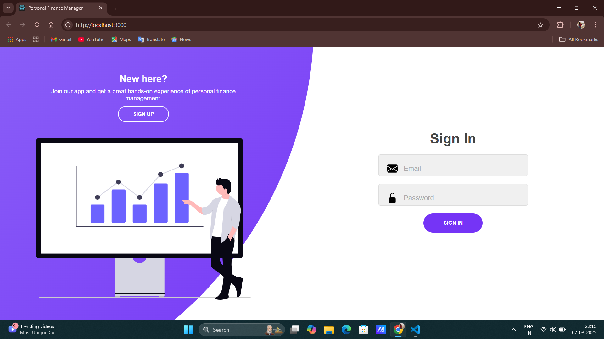
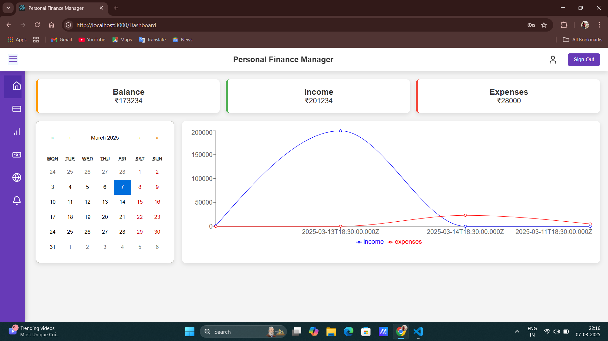

# 💰 Personal Finance Manager Web App

## 📌 Overview

The **Personal Finance Management Web App** is a full-featured financial tracking platform that helps users efficiently manage their income, expenses, loans, and bill payments. The application offers **real-time financial insights**, secure authentication, and seamless tracking of personal finances. 

This web application is built with:
- **Frontend**: React.js (for a dynamic and responsive UI)
- **Backend**: Node.js & Express.js (for API handling)
- **Database**: MongoDB (for secure data storage)

Whether you want to **track expenses, set bill reminders, or manage loans**, this app provides a user-friendly interface to keep your financial life organized.

---

## 🌟 Features

### 🔐 **User Authentication**
- Secure **Signup & Login** using JWT authentication.
- User data securely stored in MongoDB.

### 💰 **Transaction Management**
- **Add, Edit, and Delete transactions** (income/expenses).
- Categorize transactions for better tracking.
- View financial summaries and breakdowns.

### 🔔 **Bill Reminders**
- Set automatic bill reminders for upcoming due payments.
- Get notified before due dates.

### 🏦 **Loan Management**
- Keep track of **loans taken** and **loans given**.
- Monitor loan repayments and remaining balances.

### 📊 **Dashboard Analytics**
- View **visual graphs** of spending habits.
- Track monthly, weekly, and daily financial summaries.

### 🔒 **Secure Data Storage**
- Encrypted data storage with MongoDB.
- User authentication using JWT.

---
## 🖼️ Screenshots
### 📌 Signin Page

### 📌 Dashboard View

